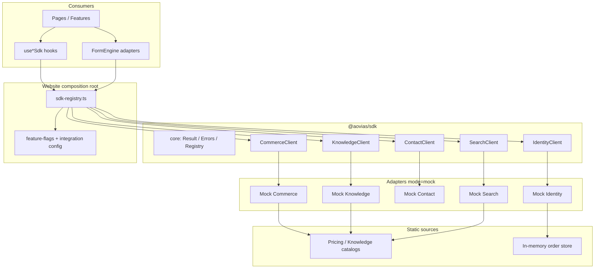

# R1.5 — Adapter Architecture Diagram

**Date:** 2026-07-20

---

```mermaid
flowchart TB
  subgraph consumers [Consumers]
    Pages[Pages / Features]
    Forms[FormEngine adapters]
    Hooks[use*Sdk hooks]
  end

  subgraph contracts ["@aovias/sdk"]
    Core[core: Result / Errors / Registry]
    ID[IdentityClient]
    CM[CommerceClient]
    CT[ContactClient]
    KN[KnowledgeClient]
    SR[SearchClient]
  end

  subgraph composition [Website composition root]
    Reg[sdk-registry.ts]
    Flags[feature-flags + integration config]
  end

  subgraph adapters [Adapters mode=mock]
    MId[Mock Identity]
    MCm[Mock Commerce]
    MCt[Mock Contact]
    MKn[Mock Knowledge]
    MSr[Mock Search]
  end

  subgraph data [Static sources]
    Catalogs[Pricing / Knowledge catalogs]
    Memory[In-memory order store]
  end

  Pages --> Hooks
  Pages --> Forms
  Hooks --> Reg
  Forms --> Reg
  Reg --> Flags
  Reg --> ID & CM & CT & KN & SR
  ID --> MId
  CM --> MCm
  CT --> MCt
  KN --> MKn
  SR --> MSr
  MCm --> Catalogs
  MKn --> Catalogs
  MSr --> Catalogs
  MId --> Memory
```

Release 2 replaces mock adapter factories with HTTP adapters **without changing Pages or Form UIs**.
