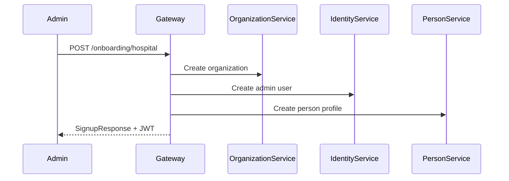
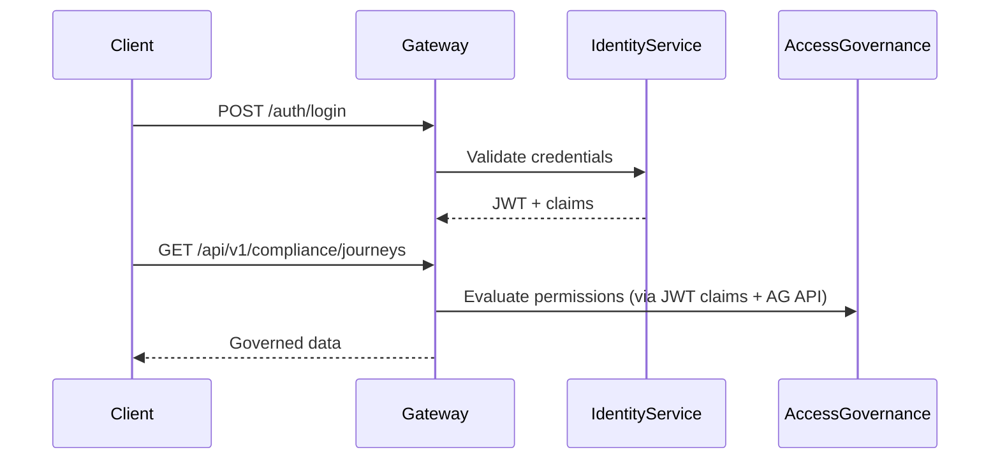
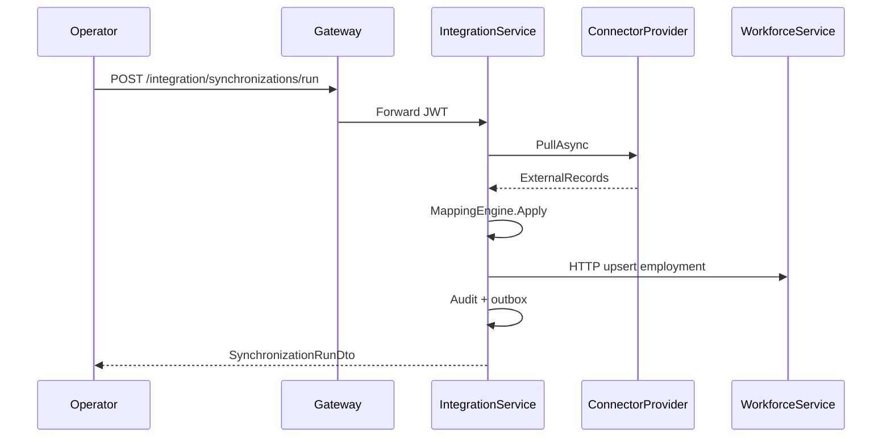
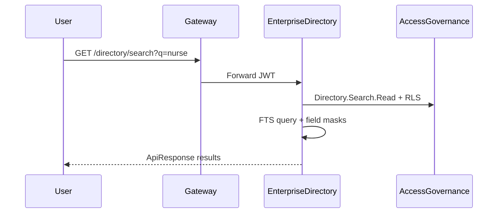
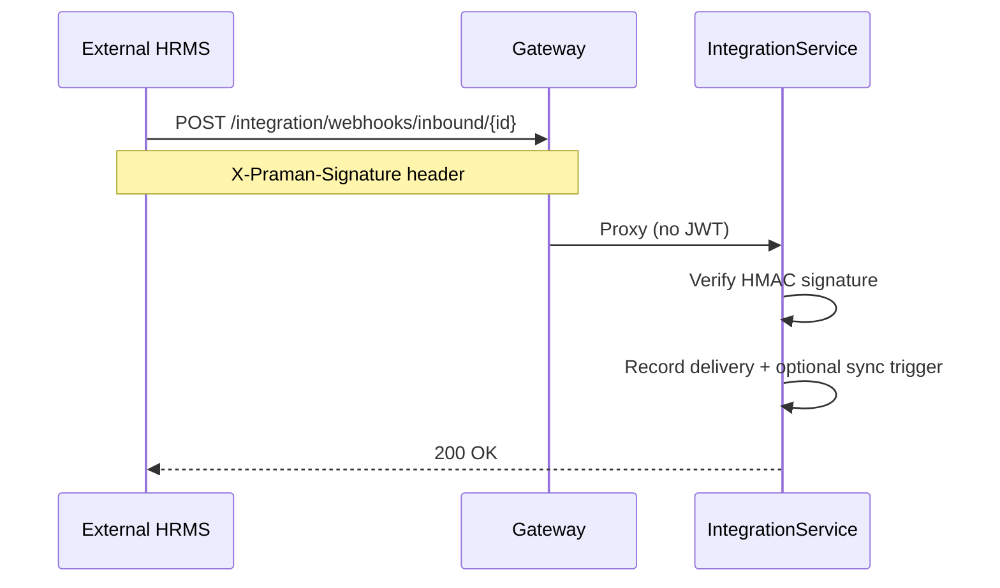
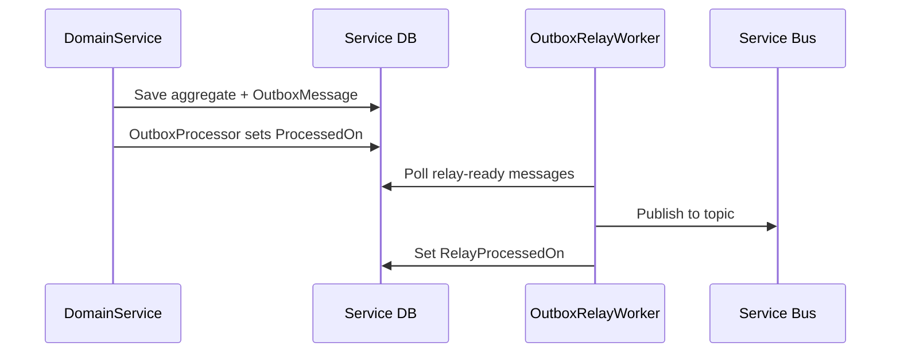

# EIWAM Sequence Diagrams

## Hospital onboarding

```mermaid
sequenceDiagram
  participant Admin
  participant GW as Gateway
  participant Org as OrganizationService
  participant Id as IdentityService
  participant Person as PersonService

  Admin->>GW: POST /onboarding/hospital
  GW->>Org: Create organization
  GW->>Id: Create admin user
  GW->>Person: Create person profile
  GW-->>Admin: SignupResponse + JWT
```

## Authentication

```mermaid
sequenceDiagram
  participant Client
  participant GW as Gateway
  participant Id as IdentityService
  participant AG as AccessGovernance

  Client->>GW: POST /auth/login
  GW->>Id: Validate credentials
  Id-->>GW: JWT + claims
  Client->>GW: GET /api/v1/compliance/journeys
  GW->>AG: Evaluate permissions (via JWT claims + AG API)
  GW-->>Client: Governed data
```

## Enterprise sync (Phase 12)

```mermaid
sequenceDiagram
  participant Op as Operator
  participant GW as Gateway
  participant IS as IntegrationService
  participant Conn as ConnectorProvider
  participant WF as WorkforceService

  Op->>GW: POST /integration/synchronizations/run
  GW->>IS: Forward JWT
  IS->>Conn: PullAsync
  Conn-->>IS: ExternalRecords
  IS->>IS: MappingEngine.Apply
  IS->>WF: HTTP upsert employment
  IS->>IS: Audit + outbox
  IS-->>Op: SynchronizationRunDto
```

## Governed directory search

```mermaid
sequenceDiagram
  participant User
  participant GW as Gateway
  participant EDS as EnterpriseDirectory
  participant AG as AccessGovernance

  User->>GW: GET /directory/search?q=nurse
  GW->>EDS: Forward JWT
  EDS->>AG: Directory.Search.Read + RLS
  EDS->>EDS: FTS query + field masks
  EDS-->>User: ApiResponse results
```

## Integration webhook inbound

```mermaid
sequenceDiagram
  participant Ext as External HRMS
  participant GW as Gateway
  participant IS as IntegrationService

  Ext->>GW: POST /integration/webhooks/inbound/{id}
  Note over Ext,GW: X-Praman-Signature header
  GW->>IS: Proxy (no JWT)
  IS->>IS: Verify HMAC signature
  IS->>IS: Record delivery + optional sync trigger
  IS-->>Ext: 200 OK
```

## Outbox event relay

```mermaid
sequenceDiagram
  participant Svc as DomainService
  participant DB as Service DB
  participant Relay as OutboxRelayWorker
  participant SB as Service Bus

  Svc->>DB: Save aggregate + OutboxMessage
  Svc->>DB: OutboxProcessor sets ProcessedOn
  Relay->>DB: Poll relay-ready messages
  Relay->>SB: Publish to topic
  Relay->>DB: Set RelayProcessedOn
```
