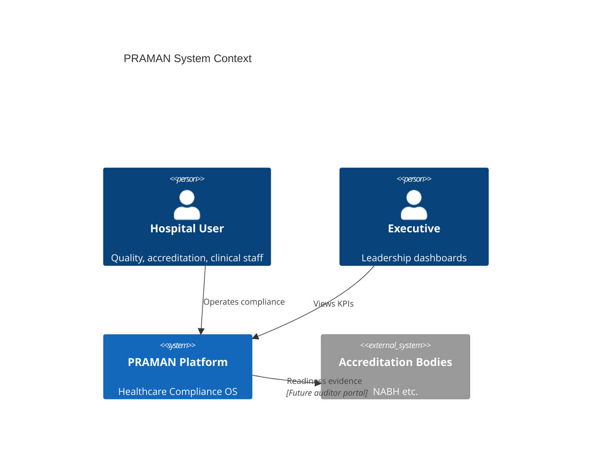

# Platform Context Diagram

[← README](../README.md)

```mermaid
C4Context
  title PRAMAN System Context
  Person(hospitalUser, "Hospital User", "Quality, accreditation, clinical staff")
  Person(executive, "Executive", "Leadership dashboards")
  System(praman, "PRAMAN Platform", "Healthcare Compliance OS")
  System_Ext(nabh, "Accreditation Bodies", "NABH etc.")
  Rel(hospitalUser, praman, "Operates compliance")
  Rel(executive, praman, "Views KPIs")
  Rel(praman, nabh, "Readiness evidence", "Future auditor portal")
```

See also [08-Technical-Architecture.md](../08-Technical-Architecture.md) deployment diagram.
